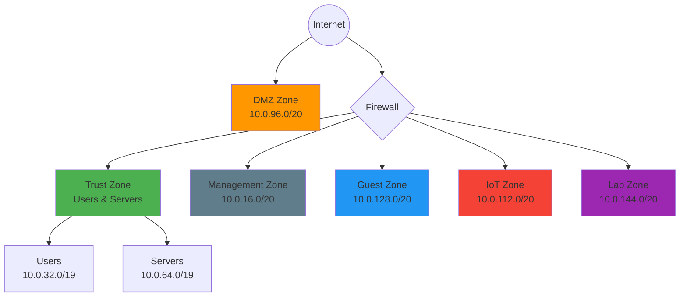
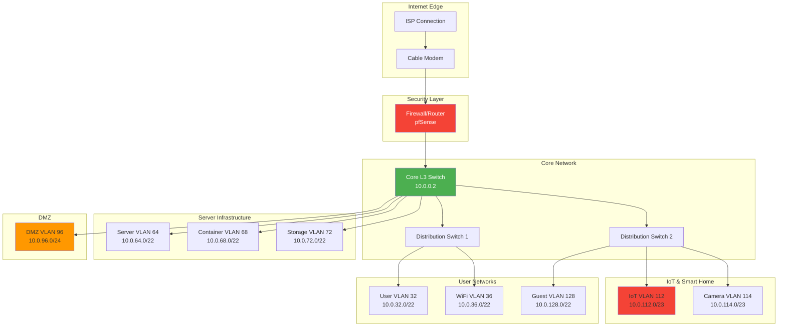

# About

## Overview

This section documents the comprehensive network design for the homelab environment, covering IP addressing strategies, network architecture, security segmentation, and operational design decisions.

!!! success "Design Goals"
    - **Security First**: Defense-in-depth with proper segmentation
    - **Scalability**: Design for growth and expansion
    - **Manageability**: Clear, logical structure for operations
    - **Performance**: Optimized for latency and throughput
    - **Resilience**: Redundancy where practical

---

## Design Documentation Structure

### :material-ip-network: IP Addressing

Comprehensive addressing strategies for both IPv4 and IPv6:

-   **IPv4 Hierarchical Design**
    
    ---
    
    RFC 1918 private addressing with functional hierarchy, VLAN mapping, and subnet allocation strategy
    
    [:octicons-arrow-right-24: View IPv4 Design](addressing/ipv4-hierarchy.md)

-   **IPv6 Strategy**
    
    ---
    
    ULA addressing, dual-stack transition plan, and IPv6-specific design considerations
    
    [:octicons-arrow-right-24: View IPv6 Strategy](addressing/ipv6-strategy.md)

-   **VLAN Design**
    
    ---
    
    VLAN segmentation, tagging strategy, and inter-VLAN routing policies
    
    [:octicons-arrow-right-24: View VLAN Design](addressing/vlan-design.md)

-   **Subnet Calculator**
    
    ---
    
    Quick reference for subnet calculations and addressing mathematics
    
    [:octicons-arrow-right-24: Subnet Tools](addressing/subnet-calculator.md)

---

### :material-sitemap: Network Architecture

Physical and logical network architecture:

-   **Physical Topology**
    
    ---
    
    Physical connectivity, cabling infrastructure, and equipment placement
    
    [:octicons-arrow-right-24: View Topology](architecture/physical-topology.md)

-   **Logical Segmentation**
    
    ---
    
    Broadcast domains, security zones, and traffic flow patterns
    
    [:octicons-arrow-right-24: Segmentation Details](architecture/logical-segmentation.md)

-   **Routing Design**
    
    ---
    
    Static routes, dynamic protocols (OSPF, BGP), and routing policies
    
    [:octicons-arrow-right-24: Routing Architecture](architecture/routing-design.md)

-   **Redundancy & HA**
    
    ---
    
    High availability configurations, failover mechanisms, and backup paths
    
    [:octicons-arrow-right-24: HA Design](architecture/redundancy-ha.md)

---

### :material-shield-lock: Security Zones

Security-focused network segmentation:

-   **DMZ Design**
    
    ---
    
    External-facing services isolation and security controls
    
    [:octicons-arrow-right-24: DMZ Architecture](security-zones/dmz-design.md)

-   **Internal Segmentation**
    
    ---
    
    Trust zone definitions and micro-segmentation strategy
    
    [:octicons-arrow-right-24: Internal Zones](security-zones/internal-segmentation.md)

-   **Guest Isolation**
    
    ---
    
    Guest network design with proper isolation and internet-only access
    
    [:octicons-arrow-right-24: Guest Networks](security-zones/guest-isolation.md)

---

## Design Highlights

### Address Space Summary

| Network Segment | IPv4 Subnet | Size | Usage |
|-----------------|-------------|------|-------|
| Infrastructure | 10.0.0.0/20 | /20 | Core networking, routing |
| Management | 10.0.16.0/20 | /20 | OOB management, monitoring |
| Users | 10.0.32.0/19 | /19 | Workstations, wireless |
| Servers | 10.0.64.0/19 | /19 | VMs, containers, storage |
| DMZ | 10.0.96.0/20 | /20 | External services |
| IoT | 10.0.112.0/20 | /20 | Smart home, cameras |
| Guest | 10.0.128.0/20 | /20 | Guest wireless |
| Lab/Test | 10.0.144.0/20 | /20 | Security lab, testing |

### Security Zone Model

### Traffic Flow Policies

!!! example "Inter-Zone Traffic Rules"
    
    | Source Zone | Destination Zone | Policy | Logging |
    |-------------|------------------|--------|---------|
    | Trust | Internet | Allow | Sample |
    | Trust | DMZ | Allow (filtered) | Full |
    | Trust | IoT | Allow (mgmt only) | Full |
    | Trust | Guest | **Deny** | Alert |
    | DMZ | Trust | **Deny** | Alert |
    | DMZ | Internet | Allow | Full |
    | IoT | Internet | Allow (filtered) | Full |
    | IoT | Trust | **Deny** | Alert |
    | Guest | Internet | Allow | Sample |
    | Guest | All Internal | **Deny** | Alert |
    | Lab | All | **Deny** (isolated) | Alert |

---

## Design Principles

### Defense in Depth

Multiple layers of security controls:

1. **Perimeter**: Firewall with stateful inspection
2. **Network**: VLAN segmentation and ACLs
3. **Host**: Host-based firewalls and hardening
4. **Application**: WAF and application-level controls
5. **Data**: Encryption at rest and in transit

### Zero Trust Concepts

Applied where practical:

- **Verify Explicitly**: Authentication for management access
- **Least Privilege**: Minimal necessary access between zones
- **Assume Breach**: Monitoring and detection in all zones

### Operational Excellence

Designed for maintainability:

- **Consistent Patterns**: Predictable addressing and naming
- **Documentation**: Self-documenting where possible
- **Automation**: IaC and configuration management ready
- **Monitoring**: Comprehensive visibility

---

## Network Diagram

### High-Level Architecture

---

## Design Evolution

### Current State (Phase 3)

- ✅ Hierarchical addressing implemented
- ✅ VLAN segmentation complete
- ✅ Security zones defined and enforced
- ✅ Monitoring infrastructure deployed
- 🔄 IPv6 dual-stack in progress

### Roadmap

#### Short Term (3-6 months)
- Complete IPv6 deployment across all segments
- Implement network automation with Ansible
- Deploy IDS/IPS inline

#### Medium Term (6-12 months)
- Add second site for geo-redundancy
- Implement SD-WAN for multi-site
- Deploy zero-trust network access (ZTNA)

#### Long Term (12+ months)
- Software-defined networking (SDN) evaluation
- 10G backbone upgrade
- Advanced telemetry and flow analysis

---

## Design Validation

### Testing Methodology

All design changes undergo validation:

1. **Lab Testing**: Prove concepts in isolated lab
2. **Staged Rollout**: Implement in phases
3. **Monitoring**: Comprehensive metrics collection
4. **Rollback Plan**: Documented reversion procedure

### Performance Benchmarks

| Metric | Target | Current |
|--------|--------|---------|
| Inter-VLAN Latency | <1ms | 0.3ms |
| Internet Throughput | 950Mbps | 940Mbps |
| Firewall PPS | 100k+ | 85k avg |
| DNS Resolution | <20ms | 12ms avg |
| DHCP Response | <100ms | 45ms avg |

---

## Reference Materials

### Standards Followed

- **RFC 1918**: Private IPv4 Address Allocation
- **RFC 4193**: IPv6 Unique Local Addresses
- **IEEE 802.1Q**: VLAN Tagging
- **NIST SP 800-41**: Firewall Guidelines
- **NIST SP 800-125**: VM Security

### External Resources

- [IETF RFCs](https://www.ietf.org/rfc/)
- [Cisco Design Guides](https://www.cisco.com/c/en/us/solutions/design-zone.html)
- [NIST Cybersecurity Framework](https://www.nist.gov/cyberframework)

---

*Last Updated: {{ git_revision_date_localized }}*