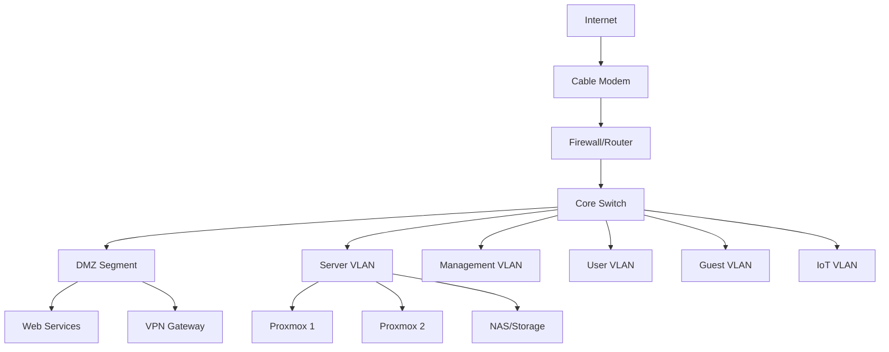

# Homelab Network Documentation

Welcome to my professional homelab network documentation. This site showcases enterprise-grade network design, implementation, and security practices applied in a home production and testing environment.

## :material-information: Overview

This documentation covers a multi-segment network infrastructure designed with security, scalability, and operational best practices in mind. The environment serves as both a production home network and a learning laboratory for advanced networking and cybersecurity concepts.

!!! info "Documentation Purpose"
    This site demonstrates technical competency in network engineering, security implementation, and infrastructure automation while serving as a practical reference for ongoing projects and configurations.

## :material-network: Network Highlights

### Design Principles

- **Hierarchical Addressing**: Structured IPv4 and IPv6 addressing schemes
- **Defense in Depth**: Multiple security layers with proper segmentation
- **High Availability**: Redundant paths and services where practical
- **Automation Ready**: Configuration management and IaC integration
- **Monitoring First**: Comprehensive visibility into network operations

### Core Capabilities

| Capability | Implementation |
|------------|----------------|
| **Routing** | BGP, OSPF, Static routing with policy-based forwarding |
| **Switching** | VLANs, Trunking, Layer 3 switching, Port security |
| **Security** | Firewall, IDS/IPS, VPN, Network segmentation |
| **Virtualization** | Proxmox, ESXi, Docker, Kubernetes |
| **Services** | DNS, DHCP, NTP, Syslog, RADIUS, Monitoring |
| **Storage** | NAS, iSCSI, NFS, Backup infrastructure |

## :material-sitemap: Architecture Overview

## :material-rocket: Quick Start

### For Network Engineers

Explore the **[Network Design](design/index.md)** section to review:

- Hierarchical IP addressing strategy
- VLAN design and segmentation approach
- Routing protocol implementations
- High availability configurations

### For Security Professionals

Check out the **[Security](security/index.md)** section covering:

- Firewall rule design and policies
- Network segmentation strategies
- Intrusion detection/prevention
- VPN configurations and access control

### For Lab Enthusiasts

Browse **[Projects](projects/index.md)** to see:

- Current infrastructure initiatives
- Completed implementations with lessons learned
- Future roadmap and planned enhancements

## :material-file-document: Key Documentation Sections

-   :material-network-outline:{ .lg .middle } **Network Design**

    ---

    Comprehensive addressing plans, architecture diagrams, and design rationale for all network segments

    [:octicons-arrow-right-24: Explore Design](design/index.md)

-   :material-server-network:{ .lg .middle } **Infrastructure**

    ---

    Core network equipment, services configuration, and storage architecture documentation

    [:octicons-arrow-right-24: View Infrastructure](infrastructure/index.md)

-   :material-shield-lock:{ .lg .middle } **Security**

    ---

    Firewall policies, security zones, monitoring systems, and threat detection implementations

    [:octicons-arrow-right-24: Security Details](security/index.md)

-   :material-cube-outline:{ .lg .middle } **Virtualization**

    ---

    Hypervisor configurations, container orchestration, and virtual networking setup

    [:octicons-arrow-right-24: Virtual Infrastructure](virtualization/index.md)

-   :material-briefcase:{ .lg .middle } **Active Projects**

    ---

    Current initiatives, work in progress, and experimental implementations

    [:octicons-arrow-right-24: See Projects](projects/index.md)

-   :material-book-open-variant:{ .lg .middle } **Knowledge Base**

    ---

    Tutorials, troubleshooting guides, and technical reference materials

    [:octicons-arrow-right-24: Browse KB](kb/index.md)

## :material-chart-line: Network Statistics

!!! success "Current Metrics"
    - **VLANs Configured**: 8 production segments
    - **Routing Protocols**: OSPF + BGP (lab)
    - **Firewall Rules**: 150+ with documentation
    - **Active Services**: 25+ network services
    - **VM Count**: 40+ across hypervisors
    - **Storage Capacity**: 32TB usable (ZFS)
    - **Uptime Target**: 99.5% for core services

## :material-timeline: Recent Updates

### January 2025
- ✅ Completed IPv6 dual-stack deployment across infrastructure
- ✅ Implemented unified monitoring with Prometheus/Grafana
- 🔄 In progress: Network automation with Ansible

### December 2024
- ✅ Deployed site-to-site VPN to secondary location
- ✅ Migrated to Proxmox 8.x cluster
- ✅ Enhanced firewall rules with geo-blocking

### November 2024
- ✅ Implemented VLAN segmentation for IoT devices
- ✅ Set up centralized logging with Graylog
- ✅ Added network traffic analysis tools

---

## :material-information-outline: About This Lab

This homelab represents an ongoing commitment to professional development in network engineering and cybersecurity. The environment is continuously evolving as new technologies are learned, tested, and integrated.

**Key Learning Areas:**

- Enterprise network design patterns
- Security architecture and implementation
- Infrastructure automation and DevOps practices
- Virtualization and containerization
- Monitoring, logging, and observability
- Troubleshooting and performance optimization

!!! tip "Feedback Welcome"
    This documentation is maintained as a living reference. If you have questions, suggestions, or spot areas for improvement, please feel free to reach out via the [contact page](about/contact.md).

## :material-license: Documentation License

This documentation is licensed under [CC BY-NC-SA 4.0](https://creativecommons.org/licenses/by-nc-sa/4.0/). Configuration examples and code snippets are provided as-is for educational purposes.

---

*Last Updated: {{ git_revision_date_localized }}*