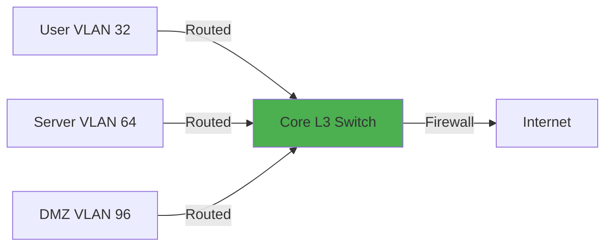

# IPv4 Hierarchical Addressing Design

## Overview

This document outlines the IPv4 addressing strategy for managed environments, following best practices for scalability, security, and operational efficiency.

!!! abstract "Design Principles"
    - **RFC 1918 Private Addressing**: Using 10.0.0.0/8 and 192.168.0.0/16 as primary spaces
    - **Hierarchical Structure**: Clear segmentation by function and security zone
    - **Scalability**: Room for growth within each segment
    - **Documentation**: Self-documenting through structured allocation
    - **Security**: Support for micro-segmentation and zone-based policies

## Address Space Allocation

### Residential Allocation - 192.168.0.0/16 - res.ashton.bz (16 sites max)

The entire allocation divides the 192.168.0.0/16 RFC 1918 space into /20 per site:

```
192.168.0.0/16 - Residential Allocation - TIER 0 
├── 192.168.0.0/17   - Primary Residential - TIER 1
├──── 192.168.0.0/20  - Site #1 - TIER 2
├────── 192.168.0.0/21  - Active Allocation - TIER 3
├────── 192.168.8.0/21  - Reserved for Expansion
├──── 192.168.16.0/20  - Site #2
├────── 192.168.16.0/21  - Active Allocation
├────── 192.168.24.0/21  - Reserved for Expansion
├──── 192.168.32.0/20  - Site #3
├──── 192.168.48.0/20  - Site #4
├──── 192.168.64.0/18  - Reserved for Expansion
├── 192.168.128.0/17   - Secondary Residential
├──── 192.168.128.0/20  - Site #1
├──── 192.168.144.0/20  - Site #2
├──── 192.168.160.0/20  - Site #3
├──── 192.168.176.0/20  - Site #4
└──── 192.168.192.0/18  - Reserved for Expansion

```

---

#### Site VLAN to /24 Subnet Mapping

| VLAN ID | Subnet | Purpose | Gateway | Security Zone |
|---------|--------|---------|---------|---------|
| 1 | [SUBNET #1] | Default VLAN | 192.168.#.1 | DMZ |
| [O3] + 10 | 192.168.[O3].0/24 | VLAN ID Logic | 192.168.[O3].1 | [Zone] |
| # | [SUBNET #2-7] | Function | 192.168.#.1 | Internal |
| # | [SUBNET #8] | Reserved for Smaller Segments | 192.168.#.1 | -- |
| # | [SUBNET #9-16] | Reserved for Site Expansion | 192.168.#.1 | -- |
---

#### Allocated Sites

##### 192.168.0.0/20 - Site #1 - LAX
```
├── 192.168.0.0/21   - Active Allocation
├──── 192.168.0.0/24  - Native VLAN (Onboarding/Quarantine)
├──── 192.168.1.0/24  - Management
├──── 192.168.2.0/24  - Trusted Devices
├──── 192.168.3.0/24  - Smart Home / IoT
├──── 192.168.4.0/24  - Guest
├──── 192.168.5.0/24  - Reserved for future use
├──── 192.168.6.0/24  - Reserved for future use
├──── 192.168.7.0/24  - Reserved for Special Use Smaller Segments
├── 192.168.8.0/21   - Reserved for Expanision
```
| VLAN ID | Subnet | Purpose | Gateway | Security Zone |
|---------|--------|---------|---------|---------|
| 1 | 192.168.0.0/24 | Default VLAN | 192.168.0.1 | DMZ |
| 11 | 192.168.1.0/24 | Management | 192.168.1.1 | Internal |
| 12 | 192.168.2.0/24 | Trusted Devices | 192.168.2.1 | Internal |
| 13 | 192.168.3.0/24 | Smart Home/IoT | 192.168.3.1 | Untrusted |
| 14 | 192.168.4.0/24 | Guest | 192.168.4.1 | Untrusted |
| 15 | 192.168.5.0/24 | Reserved for future use | 192.168.5.1 | -- |
| 16 | 192.168.6.0/24 | Reserved for future use | 192.168.6.1 | -- |
| # | 192.168.7.0/24 | Reserved for Smaller Segments | 192.168.7.# | -- |
---

##### 192.168.46.0/20 - Site #1 - SJC
```
├── 192.168.16.0/21   - Active Allocation
├──── 192.168.16.0/24  - Native VLAN (Onboarding/Quarantine)
├──── 192.168.17.0/24  - Management
├──── 192.168.18.0/24  - Trusted Devices
├──── 192.168.19.0/24  - Smart Home / IoT
├──── 192.168.20.0/24  - Guest
├──── 192.168.21.0/24  - Existing LAN - 4 x /26
├──── 192.168.22.0/24  - Reserved for future use
├──── 192.168.23.0/24  - Reserved for Special Use Smaller Segments
├── 192.168.24.0/21   - Reserved for Expanision
```
| VLAN ID | Subnet | Purpose | Gateway | Security Zone |
|---------|--------|---------|---------|---------|
| 1 | 192.168.16.0/24 | Default VLAN | 192.168.16.1 | DMZ |
| 27 | 192.168.17.0/24 | Management | 192.168.17.1 | Internal |
| 28 | 192.168.18.0/24 | Trusted Devices | 192.168.18.1 | Internal |
| 29 | 192.168.19.0/24 | Smart Home/IoT | 192.168.19.1 | Untrusted |
| 30 | 192.168.20.0/24 | Guest | 192.168.20.1 | Untrusted |
| 31 | 192.168.21.0/24 | Existing LAN | 192.168.21.[NET + 10] | Internal |
| 32 | 192.168.22.0/24 | Reserved for future use | 192.168.22.1 | -- |
| # | 192.168.23.0/24 | Reserved for Smaller Segments | 192.168.7.# | -- |
---

### Global Homelab Allocation - 10.0.0.0/8 prod.ashton.bz

The entire allocation divides 10.0.0.0/8 RFC 1918 space in /18 per site:

```
10.0.0.0/8 - Corporate Allocation - TIER 0 
├── 10.0.0.0/10   - Production Block - TIER 1
├──── 10.0.0.0/11 - Physical Sites - TIER 2
├────── 10.0.0.0/14 - Global Services - TIER 3
├────── 10.0.0.0/16 - Region # - TIER 4
├──────── 10.0.0.0/18 - Site # - TIER 5
├────── 10.4.0.0/14 - North America
├────── 10.8.0.0/14 - LATAM
├────── 10.12.0.0/14 - EMEA
├────── 10.16.0.0/12 - Reserved for Future Growth
├──── 10.32.0.0/11 - Cloud Sites
├────── 10.32.0.0/14 - AWS
├────── 10.36.0.0/14 - Linode
├────── 10.40.0.0/14 - Azure
├────── 10.44.0.0/14 - Google Gloud
├────── 10.48.0.0/12 - Reserved for Future Growth
├── 10.64.0.0/10   - Development Block
├── 10.128.0.0/10   - Staging / Testing
└── 10.192.0.0/10   - DMZ / Edge

```

---

## VLAN to Subnet Mapping

| VLAN ID | Subnet | Purpose | Gateway |
|---------|--------|---------|---------|
| 1 | Native (unused) | Default VLAN | - |
| 10 | 10.0.16.0/23 | Management | 10.0.16.1 |
| 32 | 10.0.32.0/22 | User Network | 10.0.32.1 |
| 36 | 10.0.36.0/22 | Wireless | 10.0.36.1 |
| 64 | 10.0.64.0/22 | Servers | 10.0.64.1 |
| 68 | 10.0.68.0/22 | Containers | 10.0.68.1 |
| 72 | 10.0.72.0/22 | Storage | 10.0.72.1 |
| 96 | 10.0.96.0/24 | DMZ | 10.0.96.1 |
| 112 | 10.0.112.0/23 | Smart Home | 10.0.112.1 |
| 114 | 10.0.114.0/23 | Cameras | 10.0.114.1 |
| 128 | 10.0.128.0/22 | Guest | 10.0.128.1 |
| 144 | 10.0.144.0/22 | Security Lab | 10.0.144.1 |

---

## Routing Design

### Inter-VLAN Routing

All VLANs are routed through the core Layer 3 switch or router with firewall policies applied between zones.



### Static Routes (Example)

```bash
# Route to DMZ through firewall
ip route 10.0.96.0 255.255.255.0 10.0.1.2

# Route to lab network (isolated)
# No route - lab is intentionally unreachable
```

---

## NAT Configuration

### NAT Pools

```yaml
External Services (DMZ):
  - 1:1 NAT for public-facing servers
  - Port forwarding for specific services

Internal Networks:
  - PAT (Port Address Translation)
  - Single public IP with port mapping

Lab Network:
  - No NAT (isolated from internet)
```

---

## Documentation Standards

### IP Assignment Tracking

All static IP assignments are documented in:

- **IPAM System**: NetBox/phpIPAM
- **DNS Records**: Forward and reverse zones
- **Configuration Management**: Ansible inventory
- **This Documentation**: Reference tables

### Change Management

Changes to IP addressing follow:

1. Update IPAM system
2. Update DNS records
3. Apply configuration changes
4. Update documentation
5. Test connectivity

---

## Future Considerations

### Planned Expansions

- **IPv6 Deployment**: Dual-stack all networks (see [IPv6 Strategy](ipv6-strategy.md))
- **Additional Segments**: Dedicated network for backup traffic
- **Cloud Integration**: Hybrid connectivity to AWS/Azure

### Address Space Utilization

Current utilization: ~35% of allocated space  
Projected 2-year growth: 60% utilization  
Reserved space provides 5+ years of runway

---

## Related Documentation

- [IPv6 Addressing Strategy](ipv6-strategy.md)
- [VLAN Design and Configuration](vlan-design.md)
- [Security Zone Architecture](../security-zones/index.md)
- [Firewall Rule Design](../../security/firewall/rule-design.md)

---

*Last Updated: {{ git_revision_date_localized }}*