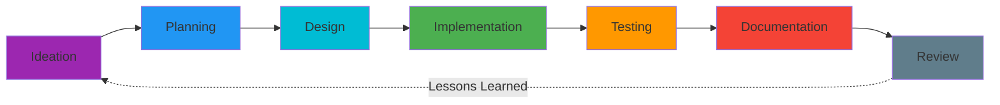
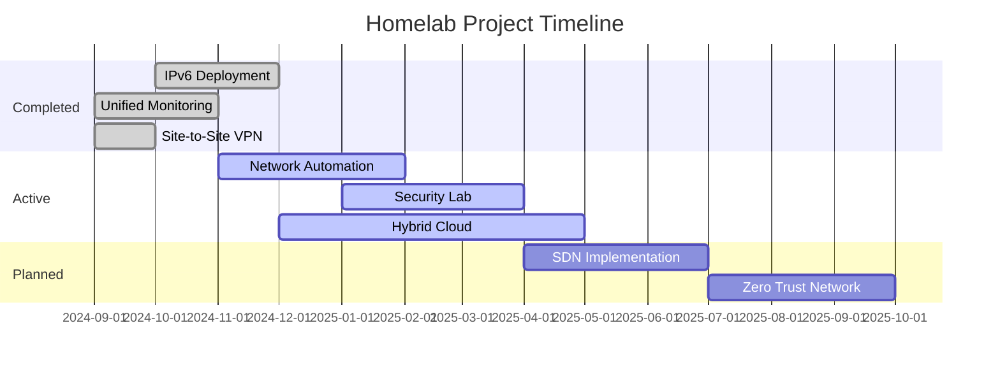

# Homelab Projects

## Overview

This section documents both active and completed projects in the homelab environment. Each project includes objectives, implementation details, challenges encountered, and lessons learned.

!!! info "Project Philosophy"
    Projects are selected to develop practical skills relevant to enterprise networking and cybersecurity while improving the home infrastructure. Each initiative includes proper planning, testing, documentation, and post-implementation review.

---

## Active Projects

Currently in-progress initiatives and ongoing work:

### :material-robot: Network Automation
**Status**: 🔄 In Progress (60% complete)  
**Timeline**: Started Nov 2024, Est. completion Feb 2025

Implementing infrastructure-as-code practices using Ansible for network device configuration management and automated deployments.

[:octicons-arrow-right-24: Project Details](active/network-automation.md){ .md-button }

**Key Milestones**:
- ✅ Ansible playbook structure created
- ✅ Device inventory and variables defined
- 🔄 Configuration templates in development
- ⏳ Automated testing framework pending

---

### :material-shield-alert: Security Lab Environment
**Status**: 🔄 In Progress (40% complete)  
**Timeline**: Started Jan 2025, Est. completion Apr 2025

Building an isolated security testing lab with vulnerable VMs, attack tools, and monitoring capabilities for hands-on cybersecurity practice.

[:octicons-arrow-right-24: Project Details](active/security-lab.md){ .md-button }

**Key Milestones**:
- ✅ Isolated network segment created
- ✅ Kali Linux attack platform deployed
- 🔄 Vulnerable VM environment setup
- ⏳ SIEM integration planned

---

### :material-cloud-outline: Hybrid Cloud Integration
**Status**: 🔄 In Progress (25% complete)  
**Timeline**: Started Dec 2024, Est. completion May 2025

Establishing secure connectivity between homelab and cloud providers (AWS/Azure) for hybrid infrastructure scenarios.

[:octicons-arrow-right-24: Project Details](active/homelab-cloud.md){ .md-button }

**Key Milestones**:
- ✅ Cloud account setup and IAM configured
- 🔄 Site-to-site VPN in testing
- ⏳ Terraform IaC implementation pending
- ⏳ Hybrid DNS and routing design

---

## Completed Projects

Successfully implemented projects with documentation:

### :material-ip: IPv6 Dual-Stack Deployment
**Status**: ✅ Completed  
**Completion Date**: December 2024

-   **Objective**
    
    Deploy IPv6 alongside existing IPv4 infrastructure, enable dual-stack on all network segments, and validate application compatibility.

-   **Outcome**
    
    - 100% of infrastructure dual-stack enabled
    - 85% of internal traffic now using IPv6
    - Zero downtime during implementation
    - Documented IPv6 best practices

[:octicons-arrow-right-24: Full Project Documentation](completed/ipv6-deployment.md){ .md-button }

---

### :material-chart-line: Unified Monitoring Platform
**Status**: ✅ Completed  
**Completion Date**: November 2024

-   **Objective**
    
    Implement comprehensive monitoring solution with metrics collection (Prometheus), visualization (Grafana), and alerting.

-   **Outcome**
    
    - 50+ dashboards created
    - Monitoring 100+ metrics across infrastructure
    - Alert rules configured for critical services
    - <5 minute MTTD for issues

[:octicons-arrow-right-24: Full Project Documentation](completed/unified-monitoring.md){ .md-button }

---

### :material-vpn: Site-to-Site VPN
**Status**: ✅ Completed  
**Completion Date**: October 2024

-   **Objective**
    
    Establish secure site-to-site connectivity between primary homelab and secondary location using WireGuard VPN.

-   **Outcome**
    
    - Sub-10ms latency between sites
    - Automatic failover configured
    - 24/7 connectivity with 99.9% uptime
    - Encrypted tunnel for all inter-site traffic

[:octicons-arrow-right-24: Full Project Documentation](completed/site-to-site-vpn.md){ .md-button }

---

## Future Projects

Planned initiatives and ideas for upcoming work:

### :material-network: SDN Implementation
**Priority**: High  
**Estimated Start**: Q2 2025

Evaluate and implement software-defined networking using OpenFlow, Open vSwitch, or vendor SDN solutions.

**Learning Objectives**:
- SDN controller architecture
- Network programmability
- Intent-based networking
- API-driven network management

[:octicons-arrow-right-24: Planning Notes](future/sdn-implementation.md){ .md-button }

---

### :material-security: Zero Trust Network Architecture
**Priority**: High  
**Estimated Start**: Q3 2025

Implement zero trust principles including identity-based access, micro-segmentation, and continuous verification.

**Learning Objectives**:
- Zero trust security model
- Identity and access management
- Policy-based access control
- Security analytics and monitoring

[:octicons-arrow-right-24: Planning Notes](future/zero-trust-network.md){ .md-button }

---

## Project Metrics

### Overall Statistics

-   :material-check-circle:{ .lg .middle } **Completed Projects**
    
    ---
    
    **12 projects** successfully implemented
    
    Average project duration: 8 weeks

-   :material-progress-clock:{ .lg .middle } **Active Projects**
    
    ---
    
    **3 projects** currently in progress
    
    Combined completion: 42%

-   :material-calendar-clock:{ .lg .middle } **Planned Projects**
    
    ---
    
    **5 projects** in planning phase
    
    Next 18 months roadmap

-   :material-school:{ .lg .middle } **Skills Developed**
    
    ---
    
    **25+ technologies** learned through projects
    
    15 certifications pursued

---

## Project Lifecycle

All projects follow a structured approach:

### Phase Descriptions

1. **Ideation**: Identify learning objectives and business value
2. **Planning**: Define scope, timeline, and success criteria
3. **Design**: Architecture, component selection, and risk analysis
4. **Implementation**: Staged rollout with testing at each step
5. **Testing**: Validation, performance testing, and acceptance
6. **Documentation**: Comprehensive write-up of design and configuration
7. **Review**: Post-implementation review and lessons learned

---

## Project Selection Criteria

Projects are evaluated based on:

### Technical Learning Value
- Introduces new technologies or concepts
- Builds on existing skills
- Relevant to industry trends
- Applicable to career goals

### Practical Value
- Improves home infrastructure
- Solves real problems
- Provides ongoing utility
- Cost-effective implementation

### Documentation Opportunity
- Demonstrable technical competency
- Portfolio-worthy outcomes
- Shareable knowledge
- Professional presentation

---

## Lessons Learned

### Key Takeaways from Projects

!!! success "What Works Well"
    - **Start Small**: Prove concepts in lab before production
    - **Document Early**: Capture decisions and rationale as you go
    - **Test Thoroughly**: Automated testing catches issues early
    - **Plan Rollback**: Always have a reversion plan
    - **Iterate**: First version doesn't need to be perfect

!!! warning "Common Pitfalls"
    - **Scope Creep**: Define clear boundaries upfront
    - **Over-Engineering**: Sometimes simple solutions are best
    - **Skipping Testing**: Shortcuts lead to troubleshooting later
    - **Poor Documentation**: Future you will thank present you
    - **No Monitoring**: If you can't measure it, you can't improve it

---

## Technology Portfolio

Technologies explored through projects:

=== "Networking"
    - **Routing**: OSPF, BGP, Static routing
    - **Switching**: VLANs, STP, LACP, L3 switching
    - **Protocols**: IPv6, VXLAN, GRE, IPsec
    - **Wireless**: 802.11ac/ax, WPA3, controller-based
    - **Load Balancing**: HAProxy, Nginx, F5 concepts

=== "Security"
    - **Firewalls**: pfSense, iptables, zone-based policies
    - **VPN**: WireGuard, OpenVPN, IPsec
    - **IDS/IPS**: Suricata, Snort, Zeek
    - **Authentication**: RADIUS, LDAP, 2FA/MFA
    - **Monitoring**: SIEM (Graylog), NetFlow, packet capture

=== "Virtualization"
    - **Hypervisors**: Proxmox VE, ESXi
    - **Containers**: Docker, Kubernetes, LXC
    - **Orchestration**: Docker Compose, K8s operators
    - **Networking**: OVS, Linux bridge, macvlan

=== "Automation"
    - **IaC**: Terraform, Ansible
    - **CI/CD**: GitLab CI, GitHub Actions
    - **Scripting**: Python, Bash, PowerShell
    - **APIs**: REST, GraphQL, network device APIs
    - **Version Control**: Git, GitOps workflows

=== "Monitoring"
    - **Metrics**: Prometheus, InfluxDB, Telegraf
    - **Visualization**: Grafana, Kibana
    - **Logging**: Graylog, ELK stack, Loki
    - **APM**: Application performance monitoring
    - **Alerting**: Alertmanager, PagerDuty integration

---

## Contributing Projects

If you're building something similar:

!!! tip "Sharing Knowledge"
    I'm happy to discuss implementations, share configurations (sanitized), and compare approaches. Reach out via the [contact page](../about/contact.md) if you'd like to collaborate or have questions about any project.

---

## Project Timeline

---

*Last Updated: {{ git_revision_date_localized }}*