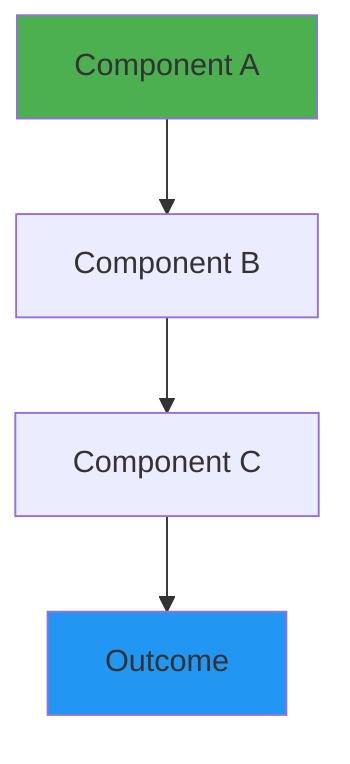
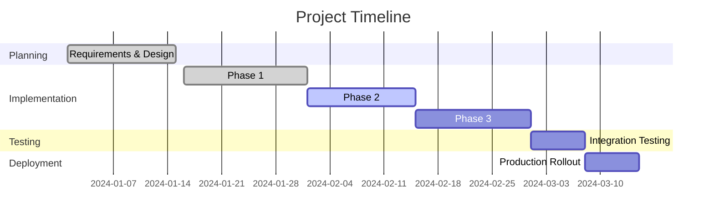
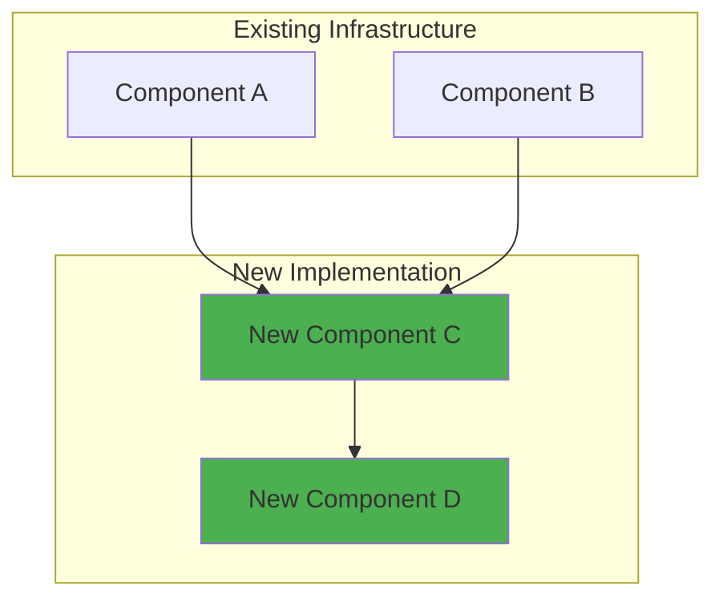
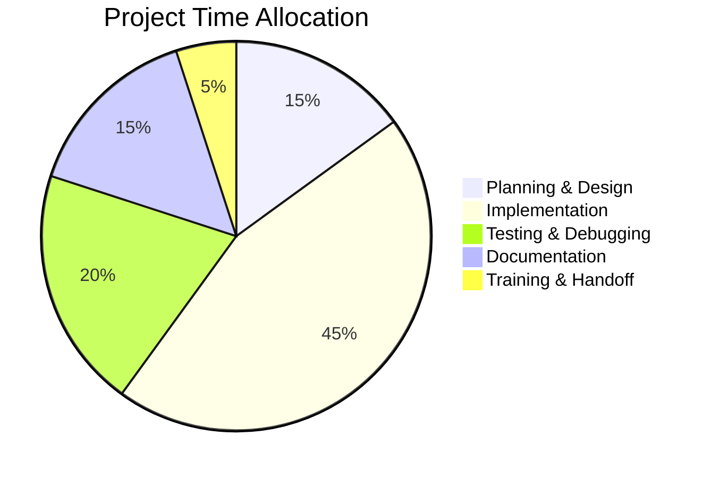

# Project Name

!!! info "Project Status"
    **Status**: 🔄 In Progress | ✅ Completed | ⏳ Planned | 🔴 On Hold  
    **Start Date**: YYYY-MM-DD  
    **Target Completion**: YYYY-MM-DD  
    **Actual Completion**: YYYY-MM-DD *(if completed)*  
    **Overall Progress**: XX%

---

## Executive Summary

<!-- Brief 2-3 sentence overview of the project -->
One paragraph describing what this project is, why it matters, and what success looks like.

**Quick Facts**:

| Attribute | Details |
|-----------|---------|
| **Category** | Network Design / Security / Automation / Infrastructure |
| **Complexity** | Low / Medium / High |
| **Duration** | X weeks/months |
| **Technologies** | Technology 1, Technology 2, Technology 3 |
| **Business Value** | Brief statement of value delivered |

---

## Objectives

### Primary Goals

What are you trying to achieve? List 3-5 specific, measurable objectives.

1. **Goal 1**: Specific objective with measurable outcome
2. **Goal 2**: Another clear objective
3. **Goal 3**: Third objective

### Learning Objectives

What skills or knowledge are you developing through this project?

- [ ] Technical skill 1
- [ ] Technical skill 2
- [ ] Soft skill or process improvement
- [ ] Certification or formal learning goal

### Success Criteria

How will you know the project is successful?

- ✓ **Criterion 1**: Specific metric or outcome
- ✓ **Criterion 2**: Another measurable criterion
- ✓ **Criterion 3**: Final success indicator

---

## Background & Motivation

### Current State

Describe the current situation that led to this project.

- What problem exists?
- What limitations are present?
- What pain points need addressing?

### Desired State

Describe the target end state after project completion.

- What will be different?
- What capabilities will exist?
- What improvements will be realized?

### Why This Project?

Explain the rationale and motivation.

- **Technical Reasons**: Why this is technically necessary or beneficial
- **Learning Value**: What makes this valuable for skill development
- **Career Relevance**: How this applies to professional goals
- **Practical Benefit**: Real-world improvements to homelab

---

## Technical Approach

### Architecture Overview

High-level description of the solution architecture.



### Technologies & Tools

| Component | Technology | Version | Purpose |
|-----------|-----------|---------|---------|
| Component 1 | Technology Name | vX.X | Why this component |
| Component 2 | Technology Name | vX.X | Purpose |
| Component 3 | Technology Name | vX.X | Role in project |

### Design Decisions

Document key architectural and design decisions with rationale.

#### Decision 1: [Decision Title]

**Context**: What situation required a decision?

**Options Considered**:
1. Option A: Pros and cons
2. Option B: Pros and cons
3. Option C: Pros and cons

**Decision**: Which option was chosen and why?

**Consequences**: What are the implications of this choice?

---

#### Decision 2: [Another Decision]

*(Repeat structure above for each major decision)*

---

## Implementation Plan

### Phase 1: [Phase Name]

**Timeline**: Week 1-2 | **Status**: ✅ Complete / 🔄 In Progress / ⏳ Pending

**Objectives**:
- Specific objective 1
- Specific objective 2

**Tasks**:
- [x] Task 1 - Completed YYYY-MM-DD
- [x] Task 2 - Completed YYYY-MM-DD
- [ ] Task 3 - In progress

**Deliverables**:
- Deliverable 1
- Deliverable 2

**Notes**: Any important observations or changes during this phase.

---

### Phase 2: [Phase Name]

**Timeline**: Week 3-4 | **Status**: 🔄 In Progress

**Objectives**:
- Objective 1
- Objective 2

**Tasks**:
- [ ] Task 1
- [ ] Task 2
- [ ] Task 3

**Blockers**: Any impediments or dependencies

---

### Phase 3: [Phase Name]

**Timeline**: Week 5-6 | **Status**: ⏳ Pending

*(Continue for additional phases)*

---

## Progress Tracking

### Milestones



### Current Status (Updated: YYYY-MM-DD)

**Overall Progress**: XX%

<div class="grid cards" markdown>

-   **Planning**
    
    ---
    
    ✅ 100% Complete
    
    Requirements defined, architecture designed

-   **Implementation**
    
    ---
    
    🔄 60% Complete
    
    Phase 2 of 3 in progress

-   **Testing**
    
    ---
    
    ⏳ 0% Complete
    
    Scheduled to begin [date]

-   **Documentation**
    
    ---
    
    🔄 40% Complete
    
    Ongoing throughout project

</div>

### Recent Updates

#### Update: YYYY-MM-DD

**What Changed**:
- Completed X, Y, Z
- Started work on A, B, C

**Challenges Encountered**:
- Issue 1 and how it was addressed
- Issue 2 and resolution approach

**Next Steps**:
- Planned work for next period

---

#### Update: YYYY-MM-DD

*(Repeat for each significant update)*

---

## Configuration & Implementation

### Key Configurations

#### Configuration 1: [Component Name]

**Purpose**: Why this configuration exists

**Configuration**:
```yaml
# Configuration snippet
key: value
nested:
  subkey: subvalue
```

**Explanation**: Walk through the important parts

**Testing**: How to verify this configuration works

---

#### Configuration 2: [Another Component]

*(Repeat structure for each major configuration)*

---

### Installation Steps

#### Step 1: Prerequisites

```bash
# Install required packages
sudo apt update
sudo apt install package1 package2

# Verify versions
package1 --version
```

#### Step 2: Initial Setup

```bash
# Configuration commands
configure-command --option value
```

#### Step 3: Verification

```bash
# Test commands
test-command
# Expected output: ...
```

---

### Network Diagram



---

## Testing & Validation

### Test Plan

| Test Case | Description | Expected Result | Actual Result | Status |
|-----------|-------------|-----------------|---------------|--------|
| TC-001 | Test scenario 1 | Expected outcome | Actual outcome | ✅ Pass |
| TC-002 | Test scenario 2 | Expected outcome | - | ⏳ Pending |
| TC-003 | Test scenario 3 | Expected outcome | - | ⏳ Pending |

### Performance Benchmarks

**Baseline Measurements** (Before):
- Metric 1: Value
- Metric 2: Value
- Metric 3: Value

**Target Measurements**:
- Metric 1: Target value (X% improvement)
- Metric 2: Target value
- Metric 3: Target value

**Actual Measurements** (After):
- Metric 1: Achieved value (X% improvement) ✅
- Metric 2: Achieved value
- Metric 3: Achieved value

### Validation Results

!!! success "Validation Summary"
    Brief summary of whether the solution meets requirements and success criteria.

**Functional Testing**: ✅ Pass / ⚠️ Partial / ❌ Fail  
**Performance Testing**: ✅ Pass / ⚠️ Partial / ❌ Fail  
**Security Testing**: ✅ Pass / ⚠️ Partial / ❌ Fail  
**User Acceptance**: ✅ Pass / ⚠️ Partial / ❌ Fail  

---

## Challenges & Solutions

### Challenge 1: [Challenge Description]

**Problem**: Detailed description of the challenge or obstacle.

**Impact**: How this affected the project (timeline, scope, quality).

**Investigation**: Steps taken to understand the problem.

**Solution**: How the problem was resolved.

**Lessons Learned**: Key takeaways from this challenge.

**Preventive Measures**: How to avoid this in future projects.

---

### Challenge 2: [Another Challenge]

*(Repeat structure for each significant challenge)*

---

### Surprises & Unexpected Findings

Things that were discovered that weren't anticipated:

- **Finding 1**: What was discovered and implications
- **Finding 2**: Another unexpected learning
- **Finding 3**: Interesting observation

---

## Lessons Learned

### What Went Well ✅

Things that worked better than expected or contributed to success:

1. **Success 1**: Description and why it worked
2. **Success 2**: Another positive aspect
3. **Success 3**: Third success factor

### What Could Be Improved ⚠️

Areas for improvement in future projects:

1. **Improvement Area 1**: What could be better and how
2. **Improvement Area 2**: Another area for growth
3. **Improvement Area 3**: Third improvement opportunity

### Key Takeaways 💡

The most important lessons from this project:

!!! tip "Key Insight 1"
    Deep insight or learning that will be applied to future work.

!!! tip "Key Insight 2"
    Another important takeaway.

!!! tip "Key Insight 3"
    Third key learning.

### Skills Developed 📚

**Technical Skills**:
- Skill 1: How it was developed and level achieved
- Skill 2: Context and proficiency gained
- Skill 3: Application and depth of knowledge

**Process Skills**:
- Project management improvements
- Documentation practices learned
- Troubleshooting methodologies refined

**Soft Skills**:
- Problem-solving approaches
- Research and learning techniques
- Time management insights

---

## Documentation & Resources

### Configuration Files

Links to configuration files in repository:

- [Main configuration file](link-to-file)
- [Supplementary config](link-to-file)
- [Script or automation](link-to-file)

### Diagrams & Visuals

- [Network topology diagram](link-to-diagram)
- [Architecture diagram](link-to-diagram)
- [Data flow diagram](link-to-diagram)

### External Resources

**Documentation References**:
- [Official documentation](https://example.com)
- [Tutorial or guide](https://example.com)
- [Community forum thread](https://example.com)

**Related Projects**:
- [Similar implementation](link)
- [Complementary project](link)

---

## Operational Procedures

### Deployment Checklist

Pre-deployment:
- [ ] All configurations tested in lab
- [ ] Backup of current configuration taken
- [ ] Rollback plan documented
- [ ] Stakeholders notified
- [ ] Maintenance window scheduled

Deployment:
- [ ] Step 1 completed
- [ ] Step 2 completed
- [ ] Step 3 completed
- [ ] Verification tests passed
- [ ] Monitoring confirmed functional

Post-deployment:
- [ ] Documentation updated
- [ ] Knowledge base updated
- [ ] Team trained on new system
- [ ] 24-hour monitoring period completed
- [ ] Project closure meeting held

### Maintenance Procedures

**Daily**:
- Monitor key metrics
- Check alert dashboard
- Review logs for anomalies

**Weekly**:
- Review performance trends
- Verify backup completion
- Check for software updates

**Monthly**:
- Conduct configuration audit
- Review and update documentation
- Test disaster recovery procedure

### Troubleshooting Guide

#### Issue: [Common Problem 1]

**Symptoms**: How to identify this problem

**Diagnosis**:
```bash
# Diagnostic commands
check-status-command
view-logs-command
```

**Resolution**:
```bash
# Fix commands
fix-command-1
fix-command-2
```

**Prevention**: How to avoid this issue

---

#### Issue: [Common Problem 2]

*(Repeat structure for common issues)*

---

## Monitoring & Metrics

### Key Metrics

| Metric | Target | Current | Trend | Status |
|--------|--------|---------|-------|--------|
| Uptime | 99.9% | 99.95% | ↑ | ✅ |
| Response Time | <100ms | 85ms | → | ✅ |
| Error Rate | <0.1% | 0.05% | ↓ | ✅ |
| Throughput | 1000 req/s | 1200 req/s | ↑ | ✅ |

### Monitoring Dashboard

**Tools Used**:
- Prometheus for metrics collection
- Grafana for visualization
- Alert Manager for notifications

**Key Dashboards**:
- [Project Performance Dashboard](link)
- [System Health Dashboard](link)
- [Error Tracking Dashboard](link)

### Alerting Configuration

| Alert | Threshold | Severity | Action |
|-------|-----------|----------|--------|
| Service Down | Availability < 99% | Critical | Page on-call |
| High Latency | Response > 500ms | Warning | Email notification |
| Error Spike | Errors > 1% | High | Slack alert |

---

## Cost Analysis

### Project Costs

| Category | Budgeted | Actual | Notes |
|----------|----------|--------|-------|
| Hardware | $XXX | $XXX | Description |
| Software/Licenses | $XXX | $XXX | Description |
| Cloud Resources | $XXX | $XXX | Description |
| Training/Courses | $XXX | $XXX | Description |
| **Total** | **$XXX** | **$XXX** | |

### Ongoing Costs

| Item | Monthly Cost | Annual Cost |
|------|-------------|-------------|
| Cloud hosting | $XX | $XXX |
| Licenses | $XX | $XXX |
| Maintenance | $XX | $XXX |
| **Total** | **$XX** | **$XXX** |

### ROI Analysis

**Time Investment**: XX hours over Y weeks

**Value Delivered**:
- Improved capability X (valued at $XXX or XX hours saved annually)
- Enhanced skill Y (career value)
- Operational efficiency gain (quantified benefit)

**Intangible Benefits**:
- Learning experience
- Portfolio enhancement
- Technical credibility

---

## Future Enhancements

### Planned Improvements

Short-term (1-3 months):
- [ ] Enhancement 1: Description and benefit
- [ ] Enhancement 2: Description and benefit
- [ ] Enhancement 3: Description and benefit

Medium-term (3-6 months):
- [ ] Improvement 1: Description and rationale
- [ ] Improvement 2: Description and impact

Long-term (6-12 months):
- [ ] Major upgrade 1: Description and value
- [ ] Major upgrade 2: Description and vision

### Ideas for Exploration

Concepts to investigate for potential implementation:

- **Idea 1**: Brief description and potential value
- **Idea 2**: Another possibility to explore
- **Idea 3**: Third concept for consideration

---

## Related Projects & Dependencies

### Upstream Dependencies

Projects or systems this project depends on:

- **[Project Name](link)**: How this dependency is used
- **[Another Project](link)**: Dependency relationship

### Downstream Beneficiaries

Projects or systems that depend on this project:

- **[Project Name](link)**: How this project enables that one
- **[Another Project](link)**: Benefit provided

### Related Initiatives

Similar or complementary projects:

- **[Related Project 1](link)**: Relationship and synergy
- **[Related Project 2](link)**: Connection and integration

---

## Team & Acknowledgments

### Project Team

| Role | Name | Contribution |
|------|------|-------------|
| Lead Engineer | Your Name | Overall design and implementation |
| Contributor | Name | Specific contribution |
| Advisor | Name | Guidance and review |

### Acknowledgments

Recognition of people who helped:

- **Person/Organization**: How they helped
- **Community Member**: Support provided
- **Documentation Author**: Resource that was valuable

### Feedback & Contact

!!! info "Questions or Suggestions?"
    If you have questions about this project or suggestions for improvements, feel free to reach out via the [contact page](../../about/contact.md).

---

## Project Timeline

### Key Dates

| Date | Milestone | Notes |
|------|-----------|-------|
| YYYY-MM-DD | Project initiation | Began planning and research |
| YYYY-MM-DD | Design completed | Architecture finalized |
| YYYY-MM-DD | Phase 1 complete | Initial implementation |
| YYYY-MM-DD | Phase 2 complete | Core features done |
| YYYY-MM-DD | Testing complete | All tests passed |
| YYYY-MM-DD | Production deployment | Went live |
| YYYY-MM-DD | Project closure | Post-implementation review |

### Time Breakdown



---

## Appendix

### Glossary

| Term | Definition |
|------|------------|
| Term 1 | Definition of technical term |
| Term 2 | Another definition |
| Acronym | What it stands for |

### References

1. Author, "Title", Publication, Date - [Link](url)
2. Documentation, "Section Title", Vendor - [Link](url)
3. RFC XXXX - "Standard Title" - [Link](url)

### Change Log

| Date | Version | Changes | Author |
|------|---------|---------|--------|
| YYYY-MM-DD | 1.0 | Initial documentation | Your Name |
| YYYY-MM-DD | 1.1 | Added section X | Your Name |
| YYYY-MM-DD | 2.0 | Major update after completion | Your Name |

---

## Quick Reference

### Common Commands

```bash
# Start service
sudo systemctl start service-name

# Check status
sudo systemctl status service-name

# View logs
sudo journalctl -u service-name -f

# Restart service
sudo systemctl restart service-name
```

### Configuration Snippets

```yaml
# Quick config reference
setting1: value1
setting2: value2
```

### Useful Links

- [Project Repository](https://github.com/...)
- [Documentation Site](https://...)
- [Monitoring Dashboard](https://...)
- [Related Documentation](link)

---

!!! success "Project Status"
    **Last Updated**: {{ git_revision_date_localized }}  
    **Status**: [Current status]  
    **Next Milestone**: [What's next]

---

*This is a living document that will be updated as the project progresses and new insights are gained.*
