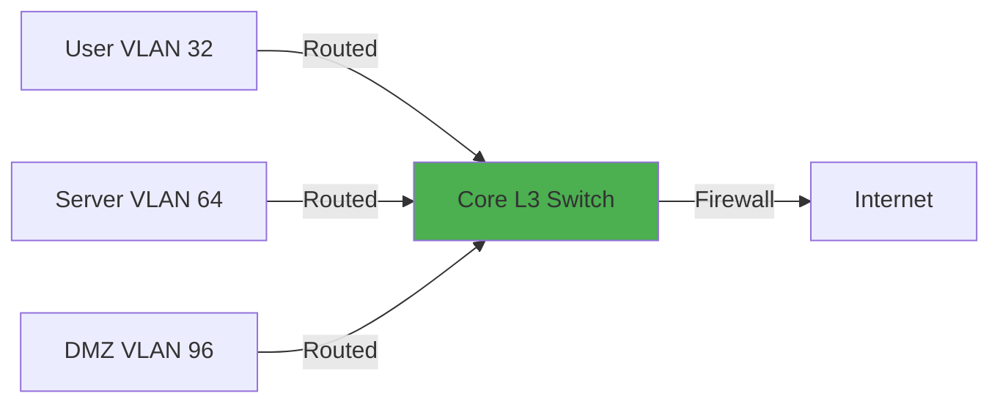

# IPv4 Hierarchical Addressing Design

## Overview

This document outlines the IPv4 addressing strategy for the homelab environment, following enterprise best practices for scalability, security, and operational efficiency.

!!! abstract "Design Principles"
    - **RFC 1918 Private Addressing**: Using 10.0.0.0/8 as primary space
    - **Hierarchical Structure**: Clear segmentation by function and security zone
    - **Scalability**: Room for growth within each segment
    - **Documentation**: Self-documenting through structured allocation
    - **Security**: Support for micro-segmentation and zone-based policies

## Address Space Allocation

### Master Allocation - 10.0.0.0/16

The entire homelab uses a /16 block from the 10.0.0.0/8 RFC 1918 space:

```
10.0.0.0/16 - Homelab Master Block
├── 10.0.0.0/20   - Infrastructure & Transit
├── 10.0.16.0/20  - Management & Monitoring
├── 10.0.32.0/19  - User & Client Networks
├── 10.0.64.0/19  - Server Networks
├── 10.0.96.0/20  - DMZ & External Services
├── 10.0.112.0/20 - IoT & Smart Home
├── 10.0.128.0/20 - Guest Networks
├── 10.0.144.0/20 - Lab & Testing
└── 10.0.160.0/19 - Reserved for Expansion
```

---

## Infrastructure & Transit (10.0.0.0/20)

### Purpose
Core network infrastructure, routing, point-to-point links, and network services.

### Breakdown

```yaml
Infrastructure Block: 10.0.0.0/20 (4,096 addresses)

├── 10.0.0.0/24    - Loopbacks & Router IDs
│   ├── 10.0.0.1     : Primary Router Loopback
│   ├── 10.0.0.2     : Core Switch Loopback
│   ├── 10.0.0.10    : Firewall Loopback
│   └── 10.0.0.20-50 : Infrastructure device loopbacks
│
├── 10.0.1.0/24    - Point-to-Point Links
│   ├── 10.0.1.0/30   : Router ↔ Firewall
│   ├── 10.0.1.4/30   : Router ↔ Core Switch
│   ├── 10.0.1.8/30   : Core Switch ↔ Distribution
│   └── ...           : Additional P2P links (/30 each)
│
├── 10.0.2.0/24    - Load Balancer VIPs
│   └── HAProxy virtual IPs for services
│
├── 10.0.3.0/24    - Network Services
│   ├── 10.0.3.1-2   : DNS Servers (Primary/Secondary)
│   ├── 10.0.3.10-11 : DHCP Servers
│   ├── 10.0.3.20    : NTP Server
│   ├── 10.0.3.30    : RADIUS Server
│   └── 10.0.3.40    : Syslog Server
│
└── 10.0.4.0/22    - Reserved Infrastructure
```

### Usage Example

```bash
# Router configuration
interface Loopback0
 ip address 10.0.0.1 255.255.255.255
 description Primary Router ID

interface GigabitEthernet0/0
 description P2P to Firewall
 ip address 10.0.1.1 255.255.255.252
```

---

## Management & Monitoring (10.0.16.0/20)

### Purpose
Out-of-band management, IPMI/iLO interfaces, and monitoring systems.

### Breakdown

```yaml
Management Block: 10.0.16.0/20 (4,096 addresses)

├── 10.0.16.0/23   - Network Device Management
│   ├── 10.0.16.0/24  : Switch Management IPs
│   └── 10.0.17.0/24  : Router/Firewall Management
│
├── 10.0.18.0/23   - Server Management (IPMI/iLO)
│   ├── 10.0.18.10-50 : Hypervisor IPMI
│   └── 10.0.18.100+  : Physical server IPMI
│
├── 10.0.20.0/23   - Monitoring Systems
│   ├── 10.0.20.10   : Prometheus Server
│   ├── 10.0.20.11   : Grafana Dashboard
│   ├── 10.0.20.20   : Graylog/ELK Stack
│   └── 10.0.20.30   : Network Monitoring (LibreNMS)
│
└── 10.0.22.0/22   - Reserved Management
```

!!! warning "Security Note"
    Management VLAN is isolated with strict ACLs. Access only from designated admin workstations.

---

## User & Client Networks (10.0.32.0/19)

### Purpose
End-user devices, workstations, and trusted client networks.

### Breakdown

```yaml
User Block: 10.0.32.0/19 (8,192 addresses)

├── 10.0.32.0/22   - Primary User VLAN
│   ├── Gateway: 10.0.32.1
│   ├── DHCP Pool: 10.0.32.100-10.0.35.254
│   └── Reserved: 10.0.32.10-99 for static assignments
│
├── 10.0.36.0/22   - Wireless Users
│   ├── Primary SSID (WPA3-Enterprise)
│   └── Separate broadcast domain for wireless
│
├── 10.0.40.0/22   - Work-from-Home VPN
│   └── Remote access VPN pool for secure access
│
└── 10.0.44.0/22   - Reserved User Networks
```

### DHCP Configuration Example

```bash
# DHCP scope for primary user VLAN
subnet 10.0.32.0 netmask 255.255.252.0 {
  range 10.0.32.100 10.0.35.254;
  option routers 10.0.32.1;
  option domain-name-servers 10.0.3.1, 10.0.3.2;
  option domain-name "homelab.local";
  default-lease-time 86400;
  max-lease-time 172800;
}
```

---

## Server Networks (10.0.64.0/19)

### Purpose
Production and lab servers, virtual machines, and application workloads.

### Breakdown

```yaml
Server Block: 10.0.64.0/19 (8,192 addresses)

├── 10.0.64.0/22   - Production Virtual Machines
│   ├── Web Servers: 10.0.64.10-29
│   ├── Application Servers: 10.0.64.30-49
│   ├── Database Servers: 10.0.64.50-69
│   └── DHCP Pool: 10.0.64.100+
│
├── 10.0.68.0/22   - Container Network
│   ├── Docker Hosts: 10.0.68.10-29
│   ├── Kubernetes Nodes: 10.0.68.30-49
│   └── Container Runtime Network
│
├── 10.0.72.0/22   - Storage Network (NAS/SAN)
│   ├── NAS Management: 10.0.72.10
│   ├── iSCSI Targets: 10.0.72.20-29
│   └── NFS Servers: 10.0.72.30-39
│
├── 10.0.76.0/22   - Development/Staging Servers
│   └── Non-production workloads
│
└── 10.0.80.0/20   - Reserved Server Networks
```

### Static Assignment Example

```yaml
# Production Web Server
Hostname: web01.homelab.local
IP: 10.0.64.10/22
Gateway: 10.0.64.1
DNS: 10.0.3.1, 10.0.3.2
VLAN: 64 (Server Production)
```

---

## DMZ & External Services (10.0.96.0/20)

### Purpose
Publicly accessible services, reverse proxies, and external-facing applications.

### Breakdown

```yaml
DMZ Block: 10.0.96.0/20 (4,096 addresses)

├── 10.0.96.0/24   - External Web Services
│   ├── 10.0.96.10  : Reverse Proxy (Nginx)
│   ├── 10.0.96.20  : Web Application 1
│   ├── 10.0.96.21  : Web Application 2
│   └── 10.0.96.30  : Mail Server (external)
│
├── 10.0.97.0/24   - VPN Endpoints
│   ├── 10.0.97.10  : WireGuard Gateway
│   ├── 10.0.97.20  : OpenVPN Gateway
│   └── 10.0.97.30  : Site-to-Site VPN
│
└── 10.0.98.0/23   - Reserved DMZ
```

!!! danger "Security Policy"
    - DMZ hosts have **no** direct access to internal networks
    - All traffic proxied through firewall with strict rules
    - Separate VLAN with aggressive monitoring

---

## IoT & Smart Home (10.0.112.0/20)

### Purpose
Internet of Things devices, smart home automation, and untrusted devices.

### Breakdown

```yaml
IoT Block: 10.0.112.0/20 (4,096 addresses)

├── 10.0.112.0/23  - Smart Home Devices
│   ├── Smart Lights/Switches
│   ├── Thermostats
│   ├── Voice Assistants
│   └── DHCP with MAC reservations
│
├── 10.0.114.0/23  - Security Cameras (IP Cameras)
│   └── Isolated segment, access to NVR only
│
└── 10.0.116.0/22  - Other IoT Devices
    └── Sensors, automation controllers
```

### Security Policies

```yaml
Firewall Rules:
  - IoT → Internet: Allow (with filtering)
  - IoT → Internal: Deny (explicit block)
  - Internal → IoT: Allow (for management)
  - IoT → IoT: Deny (device isolation)
```

---

## Guest Networks (10.0.128.0/20)

### Purpose
Guest wireless access and temporary device connections.

### Breakdown

```yaml
Guest Block: 10.0.128.0/20 (4,096 addresses)

├── 10.0.128.0/22  - Guest Wireless
│   ├── SSID: "Guest Network"
│   ├── WPA2-PSK (rotated monthly)
│   ├── Client isolation enabled
│   └── Internet-only access
│
└── 10.0.132.0/22  - Temporary Devices
    └── Short-term DHCP leases (1 hour)
```

!!! info "Guest Network Isolation"
    - Completely isolated from internal networks
    - Internet access via separate firewall policy
    - Content filtering and bandwidth throttling applied

---

## Lab & Testing (10.0.144.0/20)

### Purpose
Experimental networks, security testing, and learning environments.

### Breakdown

```yaml
Lab Block: 10.0.144.0/20 (4,096 addresses)

├── 10.0.144.0/22  - Security Lab
│   ├── Vulnerable VMs (intentionally insecure)
│   ├── Penetration testing range
│   └── Malware analysis sandbox
│
├── 10.0.148.0/22  - Network Testing
│   ├── Routing protocol labs (OSPF, BGP)
│   ├── VLAN experiments
│   └── Performance testing
│
└── 10.0.152.0/22  - General Lab
    └── Ad-hoc testing and prototyping
```

!!! warning "Lab Security"
    Lab networks are **completely isolated** from production. No routing between Lab VLANs and production segments.

---

## Reserved (10.0.160.0/19)

Reserved for future expansion as the lab grows.

---

## VLAN to Subnet Mapping

| VLAN ID | Subnet | Purpose | Gateway |
|---------|--------|---------|---------|
| 1 | Native (unused) | Default VLAN | - |
| 10 | 10.0.16.0/23 | Management | 10.0.16.1 |
| 32 | 10.0.32.0/22 | User Network | 10.0.32.1 |
| 36 | 10.0.36.0/22 | Wireless | 10.0.36.1 |
| 64 | 10.0.64.0/22 | Servers | 10.0.64.1 |
| 68 | 10.0.68.0/22 | Containers | 10.0.68.1 |
| 72 | 10.0.72.0/22 | Storage | 10.0.72.1 |
| 96 | 10.0.96.0/24 | DMZ | 10.0.96.1 |
| 112 | 10.0.112.0/23 | Smart Home | 10.0.112.1 |
| 114 | 10.0.114.0/23 | Cameras | 10.0.114.1 |
| 128 | 10.0.128.0/22 | Guest | 10.0.128.1 |
| 144 | 10.0.144.0/22 | Security Lab | 10.0.144.1 |

---

## Routing Design

### Inter-VLAN Routing

All VLANs are routed through the core Layer 3 switch or router with firewall policies applied between zones.



### Static Routes (Example)

```bash
# Route to DMZ through firewall
ip route 10.0.96.0 255.255.255.0 10.0.1.2

# Route to lab network (isolated)
# No route - lab is intentionally unreachable
```

---

## NAT Configuration

### NAT Pools

```yaml
External Services (DMZ):
  - 1:1 NAT for public-facing servers
  - Port forwarding for specific services

Internal Networks:
  - PAT (Port Address Translation)
  - Single public IP with port mapping

Lab Network:
  - No NAT (isolated from internet)
```

---

## Documentation Standards

### IP Assignment Tracking

All static IP assignments are documented in:

- **IPAM System**: NetBox/phpIPAM
- **DNS Records**: Forward and reverse zones
- **Configuration Management**: Ansible inventory
- **This Documentation**: Reference tables

### Change Management

Changes to IP addressing follow:

1. Update IPAM system
2. Update DNS records
3. Apply configuration changes
4. Update documentation
5. Test connectivity

---

## Future Considerations

### Planned Expansions

- **IPv6 Deployment**: Dual-stack all networks (see [IPv6 Strategy](ipv6-strategy.md))
- **Additional Segments**: Dedicated network for backup traffic
- **Cloud Integration**: Hybrid connectivity to AWS/Azure

### Address Space Utilization

Current utilization: ~35% of allocated space  
Projected 2-year growth: 60% utilization  
Reserved space provides 5+ years of runway

---

## Related Documentation

- [IPv6 Addressing Strategy](ipv6-strategy.md)
- [VLAN Design and Configuration](vlan-design.md)
- [Security Zone Architecture](../security-zones/index.md)
- [Firewall Rule Design](../../security/firewall/rule-design.md)

---

*Last Updated: {{ git_revision_date_localized }}*